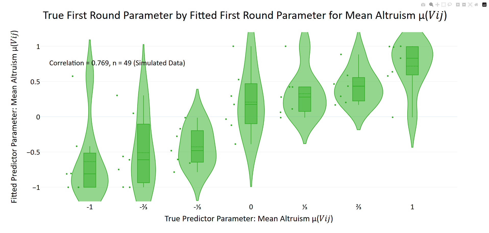
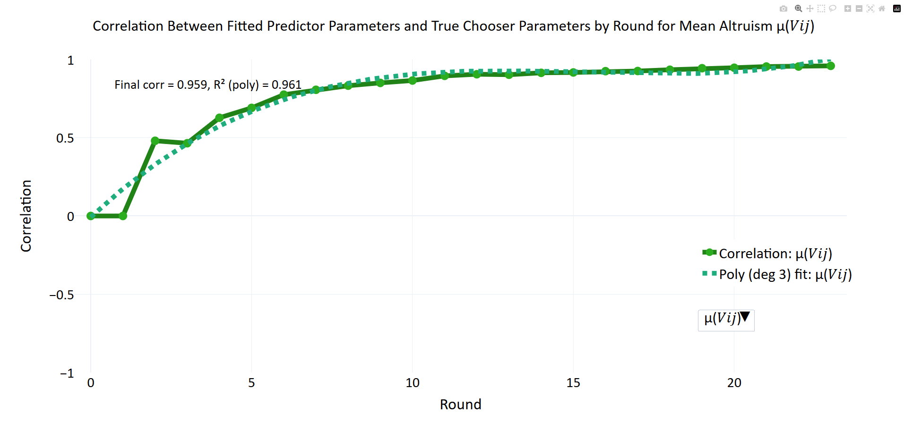
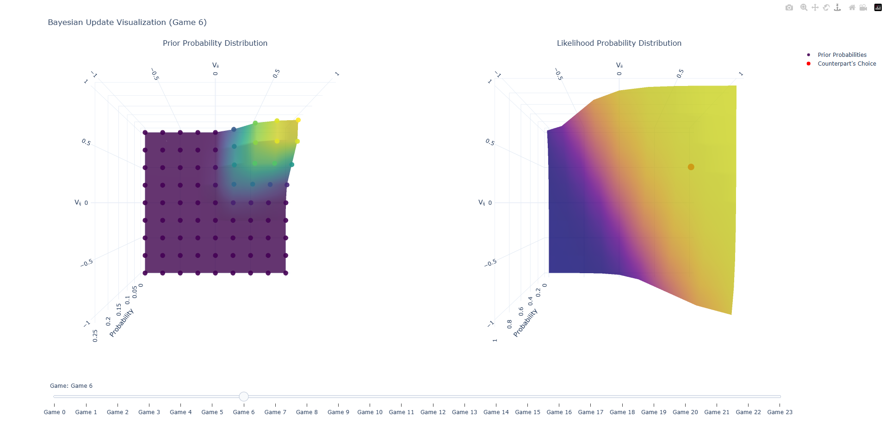

# Inferring Hidden Motives — Code Sample (Utility Bayesian Model)

This repository contains executable code for the **Utility Bayesian Model (UBM)** from *Stanley, Zhang, & Lewis (2025; arXiv)*. The UBM formalizes how an observer updates beliefs about another person’s latent *social preferences* (e.g., altruism vs. selfishness; envy vs. guilt) from their repeated payoff-allocation choices in *iterated binary dictator games*.

The full paper includes large-scale analyses (e.g., extensive parameter fitting and a 476-model utility-function comparison). Those runs can be very time-intensive. To make this code sample easy to evaluate, I provide a **quick demo** that reproduces a working subset: (i) a light-mode parameter-recovery simulation, (ii) interactive 3D belief-update visualizations, and (iii) optional model-nesting validity checks.

---

## 1) Requirements

- **Python**: 3.8+
- **Packages** [see `requirements.txt`](requirements.txt):
  - `numpy>=1.24`
  - `pandas>=2.2`
  - `scipy>=1.11`
  - `plotly==5.11.0`
  - `statsmodels>=0.14`
  - `numexpr>=2.8`

> Note: `requirements.txt` is included in the ZIP for exact reproducibility. I still list requirements here because that’s what the email requested (so you can see them without opening other files).

---

## 2) Setup + run (reproduces at least one result)

```bash
python -m venv venv
source venv/bin/activate        # Windows: venv\Scripts\activate
pip install -r requirements.txt
python run_quick_demo.py
```

All demo outputs are written under `demo_files/` so you can delete that folder afterward if desired.

---

## 3) What to look at after it runs

### A) Parameter recovery (simulation)
Open the HTML files below **in a browser**:

- **Violin plot of recovery correlations**:  
  [`demo_files/player_fits/simulation_results/corr_violin_Vij_first.html`](demo_files/player_fits/simulation_results/corr_violin_Vij_first.html)

    * Screenshot of what you should see: 

- **Correlation vs. round** (how belief accuracy improves over sequential games):  
  [`demo_files/player_fits/simulation_results/corr_by_round_sim_pred.html`](demo_files/player_fits/simulation_results/corr_by_round_sim_pred.html)  
  When it opens, select **μ(Vij)** in the dropdown.

    * Screenshot of what you should see: 

Folder:  
[`demo_files/player_fits/simulation_results/`](demo_files/player_fits/simulation_results/)

### B) 3D Bayesian belief updating
Folder:  
[`demo_files/visuals/bayesian_updates_3d/`](demo_files/visuals/bayesian_updates_3d/)

Open any HTML file in that directory. In each interactive plot:

- **Left surface** = the model’s **prior** over the target parameters.
- **Right surface** = the **likelihood** (choice probability for the option that was actually chosen).  
- **USE THE SLIDER** to step through rounds and watch the model update: priors concentrate in regions consistent with the chooser’s behavior.

    * Screenshot of what you should see: 

> You only need to run create_simulated_data once because it stores all the data used to create the figures above. You can comment it out after that. 

### C) Optional: model-nesting / “no nesting violations” sanity checks
In `run_quick_demo.py`, set:
```python
analysis_options["run_model_nesting_tests"] = True
```
…and rerun the demo. This produces CSV summaries under `demo_files/processed/` (e.g., adjacency matrices / parent-child relationships, and checks that nested models produce identical choice probabilities / losses when the parent’s extra parameters take “special” values that reduce it to the child).

---

## 4) Demo configuration (what to toggle)

At the top of `run_quick_demo.py`:

```python
analysis_options = {
    "light_mode": True,
    "run_simulation": True,
    "visualize_belief_updates": True,
    "run_model_nesting_tests": False,
}
```

- `light_mode=True` reduces the simulation scale so the demo is feasible on a laptop.
- If you want the fastest possible run, you can set `run_simulation=False` and just generate the belief-update visuals (assuming the included demo data is present).

---

## 5) Codebase structure (high level)

- `run_quick_demo.py` — entry point for the reproducible demo (creates outputs in `demo_files/`).
- `config.py` — configuration dictionaries used throughout (`general_settings`, `utility_settings`, `param_info`, `param_bds`, `fig_lay`, etc.).
- `main.py` — core model implementation + simulation + optimization + plotting + (full) analyses.
- `utilities.py` — general helpers (including utility-function enumeration and model-nesting utilities).
- `preprocessing.py` — data cleaning/merges (used by full analyses).
- `typological.py` — discrete/typological Bayesian variants (not used by the quick demo).

Additional docs:
- [`docs/data_dictionary.md`](docs/data_dictionary.md): data structures + file outputs.
- [`docs/architecture.md`](docs/architecture.md): high-level architecture notes.
- [`docs/core_function_map.md`](docs/core_function_map.md): guided map of core functions (what they do and why they matter).

---

## 6) Pointers to core implementations (files, functions, and line ranges)

Most core logic lives in `main.py`:

### Utility → choice likelihood
- `utility_term` (building blocks): **L10–L72**
- `utility` (full utility “Swiss army knife”): **L74–L275**
- `softmax_` (probabilistic choice rule): **L277–L329**
- `choice` (wraps softmax for option A/B): **L331–L385**

### Utility Bayesian Model (UBM) updating
- `prior_grid_from_params` (construct priors over latent traits): **L1029–L1090**
- `bayesian_update_grid` (grid / particle-filter posterior update): **L1092–L1339**
- `agent` (self-perpetuating UBM over sequential games): **L1341–L1699**

### Optimization + loss
- `global_local_optimization` (simulated annealing → local refinement): **L1731–L1896**
- `loss_function_bayes` (NLL from UBM predictions): **L2134–L2246**
- `create_loss_report` (stores dyad loss metadata in the first game): **L2287–L2376**
- `fit_params_by_player` (fit one player across all their dyads): **L2453–L2678**
- `run_analysis_bayes` (full fitting pipeline; supports multiprocessing): **L2680–L3086**

### Quick-demo entry points
- `create_simulated_data`: **L3179–L3556**
- `run_simulation_recovery_analysis`: **L3727–L4030**
- `visualize_bayesian_updates_3d`: **L4782–L5154**

### Model-nesting / validation utilities (used by optional demo branch)
- `model_nesting_adjacency_matrices`: **L11060–L11268**
- `run_child_parent_embedding_sanity_checks`: **L11359–L11622**
- `run_child_parent_probability_equivalence_smoketest`: **L11624–L11720**
- `build_utility_equation` (string form of the active utility): **L12250–L12502**

### Efficiency / scalability
- `verify_particle_filter_fidelity` (PF vs full-grid agreement; speed/accuracy tradeoff): **L7427–L7852**
- Multiprocessing is primarily exercised in `run_analysis_bayes` / `fit_params_by_player`.

> For detailed explanations of *why* each of these functions exists and how they compose into the full pipeline, see [`docs/CORE_FUNCTION_MAP.md`](docs/CORE_FUNCTION_MAP.md).

---

## 7) Where to find key details in the write-up (arXiv PDF)

If you’re reading the PDF and want to jump to the most relevant parts:

- **UBM formulation + implementation details**: Section **3.3**, especially **3.3.2–3.3.5** (pages ~12–25).
- **Simulation methods & results**: Section **3.3.6** (corresponds to Figures **5–6**; `light_mode` will differ slightly).
- **Belief-update visualization**: Figure **4** (the demo generates interactive 3D versions).
- **Information criterion + nesting / parent-fair comparisons**: Section **4**, especially **4.4** (pages ~31–45).

---

## 8) Optional note: Morality Game platform (separate project)
I also included short videos of the Morality Game in the Google Drive folder, which is my online multiplayer behavioral game theory experiment platform. That codebase is much larger than is practical for this code-sample request, so I’m including it as optional context rather than the primary submission. 
